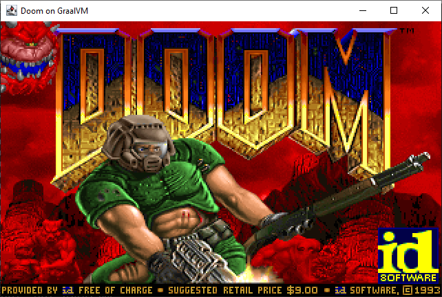

# Can GraalVM run Doom?

[Polyglot GraalVM](https://www.graalvm.org/latest/reference-manual/languages/) can run programs in multiple languages. But can it run Doom?

We took [Doom port compiled to WebAssembly](https://github.com/diekmann/wasm-fizzbuzz/tree/main/doom) created by [@diekmann](https://github.com/diekmann) and ran it on top of GraalVM. See [Internals](#Internals) for implementation details.

# GraalVM version

This program was written on GraalVM 17+ v22.3. You must install wasm support by running `gu install wasm`.

# Running

⚠ **To run correctly, you must increase stack size with `-Xss4m`**

From IDE - just run `com.stepstone.jc.demo.Doom` class

From command line - compile with `mvn package` and then run with:
```bash
java -Xss4m -jar doom-wasm-1.0-SNAPSHOT-jar-with-dependencies.jar
```

After this, you should see Java Swing window like this:



## Internals

Process of porting Doom to WASM is described in [original repo](https://github.com/diekmann/wasm-fizzbuzz/tree/main/doom).

GraalVM's support for WASM for now is very basic. One important missing feature is ability to inject java object with bindings, that will be called by wasm program.
Just running `context.eval("wasm", doomWasmBytes)` will lead to unresolved dependency to `env` and `js` modules.
There is no direct equivalent of [javascript's WebAssembly.instantiate](https://developer.mozilla.org/en-US/docs/WebAssembly/JavaScript_interface/instantiate) accessible from standard GraalVM polylgot context. That's why we need to do some hacking. We use methods accessible by WebAssembly bindings to read and instantiate WASM module and to create instance of WASM memory.

What we need to do:

* create object, that will be used have methods bindings with `js` and `env` objects inside (`com.stepstone.jc.demo.Bindings`)
* load `doom.wasm` module using `com.stepstone.jc.demo.WASMModule.module_decode`
* instantiate this module with bindings using `com.stepstone.jc.demo.WASMModule.module_instantiate`
* having this, we can run Doom's `main()` function to setup game
* then we just need to run periodically main game loop using `doom_loop_step()`

# Native image

It is also possible to compile GraalVM-WASM-based Doom into native image.

First you need to run `mvn package` and then run `native-image`:

```bash
native-image --language:wasm --initialize-at-build-time=sun.awt.Toolkit -Djava.awt.headless=false -H:ConfigurationFileDirectories=native-config -H:DynamicProxyConfigurationFiles=native-config\dynamic-proxy.json --no-fallback  -jar target\doom-wasm-1.0-SNAPSHOT-jar-with-dependencies.jar  
```

This way you will have Doom compiled to LLVM, compiled to WASM, wrapped in Java Swing app, compiled to native code. Simple, right? ¯\_(ツ)_/¯